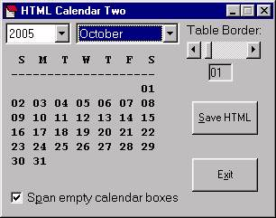



## HTML Calendar 2

### Description

This program builds a HTML web page that uses a table for a month calendar.
 
### More Info
 

             |
---                |---
**Submitted On**   |2005-03-25 20:10:44
**By**             |[David M Rice](https://github.com/Planet-Source-Code/PSCIndex/blob/master/ByAuthor/david-m-rice.md)
**Level**          |Beginner
**User Rating**    |3.7 (11 globes from 3 users)
**Compatibility**  |VB 5\.0, VB 6\.0
**Category**       |[Internet/ HTML](https://github.com/Planet-Source-Code/PSCIndex/blob/master/ByCategory/internet-html__1-34.md)
**World**          |[Visual Basic](https://github.com/Planet-Source-Code/PSCIndex/blob/master/ByWorld/visual-basic.md)
**Archive File**   |[HTML\_Calen1868243252005\.ZIP](https://github.com/Planet-Source-Code/david-m-rice-html-calendar-2__1-59648/archive/master.zip)

